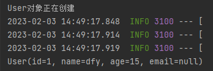
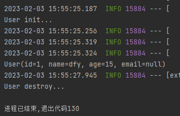

* @Configuration
    &emsp;
    > 声明一个类为配置类，用于取代bean.xml配置文件注册bean对象。<br/>
    > @Configuration注解中含有@Component注解，所以被@Configuration标记的配置类会作为一个bean对象被加载到ioc容器中。<br>
    >它通常搭配@Bean注解和@Scope注解使用。

    >@Configuration有一个属性proxyBeanMethods，用于指定是否为懒加载，默认值为true。
    proxyBeanMethods = true的情况下，保持单实例对象，在spring容器启动时就会创建bean对象。这种情况主要用在bean对象的依赖情况下，如果存在一个bean依赖另一个bean时，一般会采用Full模式。
    proxyBeanMethods = false的情况下，不检查IOC容器中是否存在，而是简单的调用方法进行创建对象，无法保持单实例。当不存在bean对象的依赖问题时，会才有轻量级的配置。

    测试代码如下：
    ```java
    @SpringBootApplication
    public class TestSpringBootApp {
        public static void main(String[] args) {
            //获取ioc容器
            ConfigurableApplicationContext run = SpringApplication.run(TestSpringBootApp.class);

            Object dogBean = run.getBean(Dog.class);
            System.out.println(dogBean);
            User userBean = (User)run.getBean(User.class);
            System.out.println(userBean);
            System.out.println(userBean.getDog()==dogBean);
        }
    }
    ```
    User类：
    ```java
    @Data
    @NoArgsConstructor
    @AllArgsConstructor
    @ToString
    public class User {
        private Integer id;
        private String name;
        private Integer age;
        private String email;

        private Dog dog;
    }
    ```
    Dog类：
    ```java
    @Data
    @NoArgsConstructor
    @AllArgsConstructor
    @ToString
    public class Dog {
        private Integer id;
        private String name;
        private Integer age;
    }

    ```
    testConfiguration类：
    ```java
    @Configuration(proxyBeanMethods = false)//多例模式
    public class TestConfiguration {

        public static int count = 0;

        @Bean
        public User userBean(){
            System.out.println("User对象创建");
            return new User(1,"dfy", 15, null, dogBean());
        }

        @Bean
        public Dog dogBean(){
            System.out.println("Dog对象第"+ (++count)+"次创建");
            return new Dog(1,"六六",3);
        }
    }
    ```
    输出结果如下：
    


    如果改成单例模式，即```proxyBeanMethods = true```，那么输出结果将变成：
    
    

* @Bean
    &emsp;
    @Bean注解通常标记一个Supplier方法，用于声明一个bean对象的注册，默认的加载模式为饿汉单例。<br/>
    > 使用@Bean声明一个bean：
    > ```java
    > @Configuration
    > public class TestConfiguration {
    > 
    >     @Bean
    >     public User userBean(){
    >         System.out.println("User对象正在创建");
    >         return new User(1,"dfy", 15, null);
    >     }
    > }
    > ```
    > ```java
    > @SpringBootApplication
    > public class TestSpringBootApp {
    >     public static void main(String[] args) {
    >         //获取ioc容器
    >         ConfigurableApplicationContext run = SpringApplication.run(TestSpringBootApp.class);
    >         Object user = run.getBean(User.class);
    >         System.out.println(user);
    >     }
    > }
    >```
    >输出结果为：
    > 
    
    @Bean注解含有如下属性：
    ```java
    public @interface Bean {
        @AliasFor("name")
        String[] value() default {};

        @AliasFor("value")
        String[] name() default {};

        /** @deprecated */
        @Deprecated
        Autowire autowire() default Autowire.NO;

        boolean autowireCandidate() default true;

        String initMethod() default "";

        String destroyMethod() default "(inferred)";
    }
    ```
    * value和name
        >可以看到value和name两个属性是一个别名对，它们的作用是指定该bean的名称。
        如果在使用时未指定bean的名称，默认使用带注解方法的名称；如果指定了，方法本身的名称就会被忽略。
        ```java
        @Configuration
        public class TestConfiguration {

            @Bean
            public User userBean(){
                System.out.println("未指定名称的User对象正在创建");
                return new User(1,"dfy", 15, null);
            }

            @Bean("User01")
            public User userBean01(){
                System.out.println("指定名称的User对象正在创建");
                return new User(1,"dfy", 15, null);
            }
        }
        ```
        ```java
        @SpringBootApplication
        public class TestSpringBootApp {
            public static void main(String[] args) {
                //获取ioc容器
                ConfigurableApplicationContext run = SpringApplication.run(TestSpringBootApp.class);
                //获取所有bean对象的名称
                String[] beanDefinitionNames = run.getBeanDefinitionNames();
                for(String s : beanDefinitionNames){
                    System.out.println(s);
                }
            }
        }
        ```
        输出结果如下：
        
    * autowire
        >已弃用。
        >autowire确定自动装配状态，即该bean创建时是否使用它的setter方法对它的成员变量进行自动装配。
        Autowire是一个枚举类，有三个值：
        > + NO：不自动装配
        > + BY_NAME：根据名称自动装配
        > + BY_TYPE：根据类型自动装配
        >默认值是NO，即不自动装配。

    * autowireCandidate
        > autowireCandidate和配置文件bean标签的autowireCandidate属性一样，就是让其他的bean在自动注入时，是否会装配当前的bean。 默认值true。
        ```java
        @Configuration
        public class TestConfiguration {

            @Bean
            public User userBean(){
                return new User(1,"dfy", 15, null, null);
            }

            @Bean
            public Dog dog1(){
                return new Dog(1,"狗宝",5);
            }

            @Bean(autowireCandidate = false)//不作为自动注入的候选者
            public Dog dog2(){
                return new Dog(2,"六六",3);
            }
        }
        ```
        ```java
        @Data
        @NoArgsConstructor
        @AllArgsConstructor
        @ToString
        @Component
        public class User {
            private Integer id;
            private String name;
            private Integer age;
            private String email;
            @Autowired
            private Dog dog;
        }
        ```
        ```java
        @SpringBootApplication
        public class TestSpringBootApp {
            public static void main(String[] args) {
                //获取ioc容器
                ConfigurableApplicationContext run = SpringApplication.run(TestSpringBootApp.class);

                Object userBean = run.getBean("userBean");
                System.out.println(userBean);
            }
        }
        ```
        输出结果为：
        ```User(id=1, name=dfy, age=15, email=null, dog=Dog(id=1, name=狗宝, age=5))```
        如果取消dog2的```autowireCandidate = false```，spring容器会报```NoUniqueBeanDefinitionException```异常。
        有趣的是，虽然spring容器启动时可以正常装配第二个Dog对象，但是idea会编译报错：
        
    * initMethod和destroyMethod
        >用于指定bean的初始化和销毁方法。
        ```java
        @Configuration
        public class TestConfiguration {

            @Bean(initMethod = "userInit", destroyMethod = "userDestroy")
            public User userBean(){
                return new User(1,"dfy", 15, null, null);
            }
        }
        ```
        ```java
        @Data
        @NoArgsConstructor
        @AllArgsConstructor
        @ToString
        @Component
        public class User {
            private Integer id;
            private String name;
            private Integer age;
            private String email;
            public void userInit(){
                System.out.println("User init...");
            }

            public void userDestroy(){
                System.out.println("User destroy...");
            }
        }
        ```
        输出结果：
        


* @Value
  >常用于标记成员变量，注入外部化属性
  @Value的三种用法：
  > * 注入普通属性
        语法为@Value(...)，直接使用字面量即可
  > * 注入配置文件
        语法为@Value("${...}")，注入配置文件中写好的属性值
  > * 注入表达式并运算
        语法为@Value("#{...}")，写入spring框架的SpEl表达式即可
        每个框架有自己的一套SpEl表达式，详情可以参考[官方文档](https://docs.spring.io/spring-framework/docs/current/reference/html/core.html#expressions)

  > 代码示例如下：
    ```java
    @Data
    @NoArgsConstructor
    @AllArgsConstructor
    @ToString
    @Component
    public class User {
        @Value("10")//注入普通属性
        private Integer id;
        @Value("${user_name}")//注入外部配置文件
        //application.yml中写入属性： user_name: user01
        private String name;
        @Value("#{2+1+3}")//注入表达式
        private Integer age;
        private String email;
        public void userInit(){
            System.out.println("User init...");
        }

        public void userDestroy(){
            System.out.println("User destroy...");
        }
    }
    ```
    ```java
    @Configuration
    public class TestConfiguration {

        @Bean
        public User userBean(){
            return new User(1,"dfy", 15, null);
        }
    }
    ```
    该bean的输出结果为：
    ```User(id=10, name=user01, age=6, email=null)```
    可以看到属性值已经成功注入，并且在new User对象时指定的默认值没有起到作用，被@Value的值覆盖掉了。

* @Scope
* @Named
* @Inject
* @Singleton
* @Lazy(true)
* @Autowired
* @Resource
* @Primary
* @Controller, @Service, @Repository, @Compnent
* @PostConstruct 和 @PreDestory 
* @Async
* @Valid,@Valided
* @RequestBody
* @CrossOrigin
* @RequestParam
* @PathVariable，@RequestHeader，@CookieValue，@RequestParam, @RequestBody，@SessionAttributes, @ModelAttribute;
* @ResponseStatus
* @RestController
* @ControllerAdvice
* 元注解包括  @Retention @Target @Document @Inherited四种
* @RequestMapping
* @GetMapping和@PostMapping